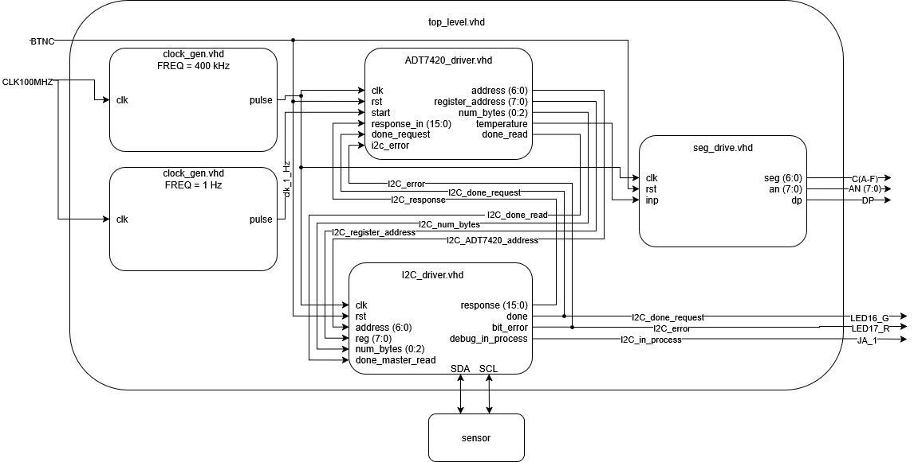

# DE1-project - I2C communication

## Documentation
This project implements an FPGA-based I2C communication system for reading temperature data from the ADT7420 and a display interface for real-time temperature visualization on a 7-segment display.

  

### Clock gen
The clock_gen module generates a clock signal at a specified frequency by dividing a 100 MHz input clock. It outputs a signal that toggles at a 50% duty cycle, effectively producing a square wave at the desired frequency. This output is used as a timing signal (e.g., 400 kHz or 1 Hz) for other modules requiring a slower clock domain.

This block uses a synchronous counter to toggle the output clock enable signal, and it does not have an external reset.

### Seg drive
The seg drive module is a synchronous module used to dislplay meassured temperature using 7 out of 8 availiable 7-segment display units with non floating decimal point. Module is able to display values in range +-99.9999. 

Input value is represented by integer value that contains actual value multiplied by 10^4 (e.g., 256365 for 25.6365). Module mathematically separates digits of input number and displays them on individual units using upgraded 7-segment driver from classes with 400 kHz refresh rate.

  

### ADT7420 driver
This module works closely with I2C driver. Specific informations about temperature sensor ADT7420 including I2C address, register value and state-machine necessary for optaining desired information is stored in this module. 

1. `start` signal is used to progress from `WAIT_FOR_START_STATE`. Edges of both clock signal and start signal could be shifted from each other depending on frequency of start signal. For that very reason `latch_start` signal is used to actually start the state-machine.
1. Module commands starts of the I2C transaction by passing necessary informations to underlying I2C driver. 
1. Module waits until I2C driver reports that commanded operation has ended either successfully (`done = '1'`) or not (`bit_error = '1'`). After unsuccesful request state-machine falls back into `WAIT_FOR_START_STATE` state.
1. After successful request module converts returnted response into temperature. Programm does not implement FPU so the convertend temperature is stored as fixed point decimal number in 10E4 degrees Celsius. Simple check of converted temperature is performed to isolate ironious values. Before falling back into `WAIT_FOR_START_STATE` `done_read <= '1'` is written for I2C driver to signal that response was read and it too can fall back into idle state.

  
  

### I2C driver
I2C driver establishes communication between ADT7420 driver and the sensor itself. The code is separated into 3 processes which are sensitive to clock signal generated by clock_gen module:
- rising_process is sensitive to rising edge of the clock signal and its responsible for switching between states (FSM), reading data from both slave and master, and increasing iterative signals as counter or read_counter.
- falling_process on the other hand based on conditional statements and iterative signals changes SDA_drive and SCL_drive signals between '0' a 'Z' ('Z' stands for released bus).
- If a signal disable_auto_SCL is set to '0' p_SCL_driver updates the SCL_drive according to the signal from clock_gen, otherwise SCL is set to 'Z'.
- SDA <= SDA_drive and SCL <= SCL_drive updates SDA and SCL outputs.
