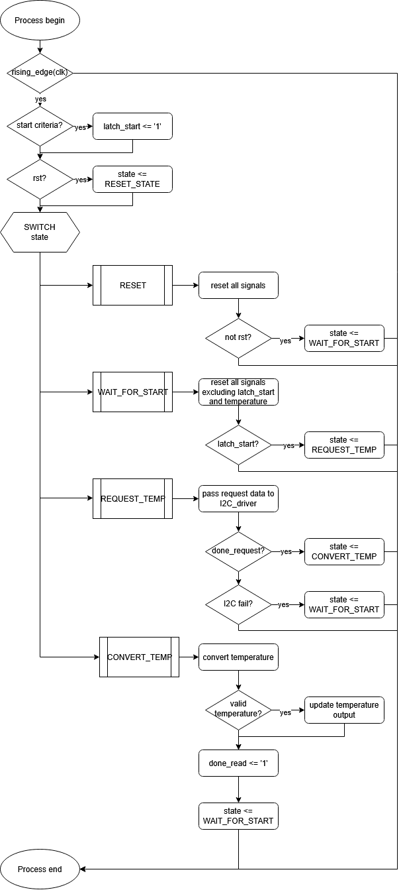
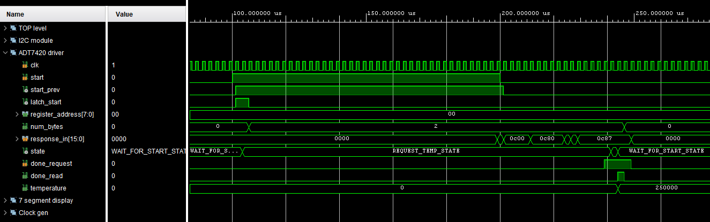

# DE1-project - I2C communication

## Documentation

### Clock gen
The clock_gen module generates a clock signal at a specified frequency by dividing a 100 MHz input clock. It outputs a signal that toggles at a 50% duty cycle, effectively producing a square wave at the desired frequency. This output is used as a timing signal (e.g., 400 kHz or 1 Hz) for other modules requiring a slower clock domain.

This block uses a synchronous counter to toggle the output clock enable signal, and it does not have an external reset.

### Seg drive

### ADT7420 driver
This module works closely with I2C driver. Specific informations about temperature sensor ADT7420 including I2C address, register value and state-machine necessary for optaining desired information is stored in this module. 

1. `start` signal is used to progress from `WAIT_FOR_START_STATE`. Edges of both clock signal and start signal could be shifted from each other depending on frequency of start signal. For that very reason `latch_start` signal is used to actually start the state-machine.
1. Module commands starts of the I2C transaction by passing necessary informations to underlying I2C driver. 
1. Module waits until I2C driver reports that commanded operation has ended either successfully (`done = '1'`) or not (`bit_error = '1'`). After unsuccesful request state-machine falls back into `WAIT_FOR_START_STATE` state.
1. After successful request module converts returnted response into temperature. Programm does not implement FPU so the convertend temperature is stored as fixed point decimal number in 10E4 degrees Celsius. Simple check of converted temperature is performed to isolate ironious values. Before falling back into `WAIT_FOR_START_STATE` `done_read <= '1'` is written for I2C driver to signal that response was read and it too can fall back into idle state.

  

### I2C driver
