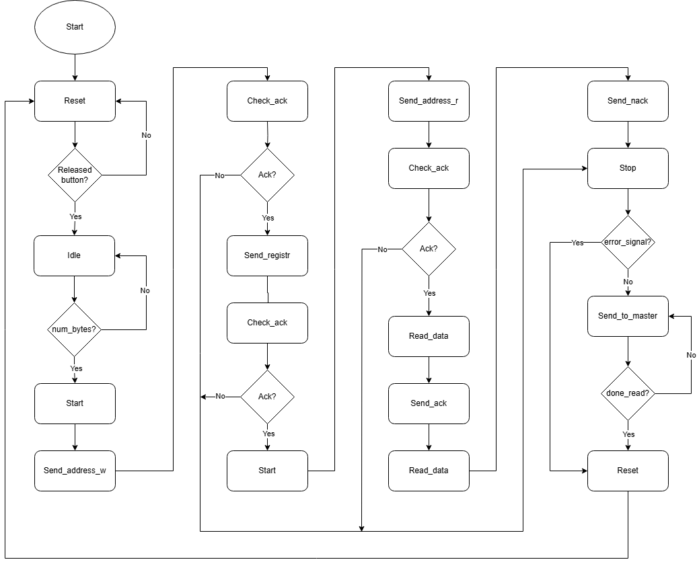

# de1-project - I2C communication

## Important notes
- Create your project in `vivado_project` directory
- While adding sources, make sure to include directories and select to **NOT** copy them into your project (leave the checkbox at the end of the window unchecket)
- In Vivado's Source File Properties make sure that the file is located at `*\<project or repository name>\src\*` and **NOT** in `*\<project or repository name>\vivado_project\*.srcs\*` directory
- When creating new sources, create then in `*\<project or repository name>\src\*` and **NOT** in default `<local to project>`

## Documentation

### Clock gen
The clock_gen module generates a clock signal at a specified frequency by dividing a 100 MHz input clock. It outputs a signal that toggles at a 50% duty cycle, effectively producing a square wave at the desired frequency. This output is used as a timing signal (e.g., 400 kHz or 1 Hz) for other modules requiring a slower clock domain.
This block uses a synchronous counter to toggle the output clock enable signal, and it does not have an external reset.

### Seg drive

### ADT7420 driver

### I2C driver
I2C driver establishes communication between ADT7420 driver and the sensor itself. The code is separated into 3 processes which are sensitive to clock signal generated by clock_gen module:
- rising_process is sensitive to rising edge of the clock signal and responsible for switching between states (FSM), reading data from both slave and master, and increasing iterative signals such as counter or read_counter.
- falling_process on the other hand based on conditional statements and iterative signals changes SDA_drive and SCL_drive signals between '0' a 'Z' ('Z' stands for released bus).
- If a signal disable_auto_SCL is set to '0' p_SCL_driver updates the SCL_drive according to the signal from clock_gen, otherwise SCL is set to 'Z'.
- Collaterally to these processes inouts SDA and SCL are updated from signals SCL_drive and SDA_drive.
The correct sequence of the FSM is stored in the array 'state_sequence'.

#### Successfull communication

#### Nack from ADT7420
1. 'Reset' is set to be always the first state in the FSM. 'Reset' state generally lasts untill the push button on the Nexys_a7_50T is not being pushed anymore so the 'rst' is low.
2. I2C_driver is in 'Idle' state untill receiving any data from ADT7420_driver, which is tested by condition 'num_bytes /= '0''.
3. 'Start_condition' is defined as  high-to-low transition on 'SDA' while 'SCL' remains high. Note that only in start/stop condition SDA doesnt change on falling edge.
4. 'Send_address_w' is processed in both rising and falling processes. In rising_process on rising edges there is an internal signal 'counter' that increases every clock period. On the other hand in falling_process we utilize the increasing 'counter' for indexing an appropriate bit in the 'address' 7-bit input vector. There is also a convertor for converting logic '1' to released bud 'Z'. 'w' in the name of this state stands for write bit ('0') which is the last bit in the 8-bit frame. 
5. After sending address there is a state 'Check_ack', which detects whether the sensor send acknowledge ('0') or not ('Z'). If the sensor didnt send the ack, signal 'error_signal' is set to '1' and the next state is 'stop', otherwise its 'Send_register'.
6. Note that for 'Send_register' is used the same logic as for the 'Send_address_w' state except the reg input vector is 8-bit and we dont deal with that last bit must be set to '0'.
7. Next follows 'Check_ack' state again and then 'Start' - no differences.
8. 'Send_address_r' is the same as with the 'w' except 'r' as a read bit stands for 'Z'. Last 'Check_ack' follows.
9. As 'Check_ack' state 'Read_data' is only in rising_process, because we need to read the data on rising_edge. At first the 'read_size' variable is set according to signals 'num_bytes' and 'read_counter'. 'read_size' represents the length of the response vector - 1 (at the beginning it should be 15 or 7). 'H' in the logic convertor means weak-pull-up.
10.  

#### Flowchart

